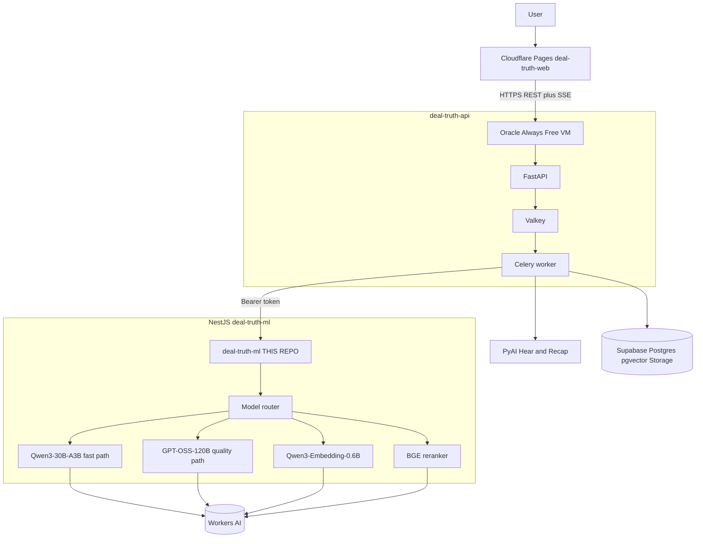

# Deal Truth ML

Hosted inference router for **Deal Truth**. This repo is a **NestJS** Node service: it routes classify / emotion / embed / rerank / generate to **Cloudflare Workers AI** over the official REST API. No model weights run on your laptop or on Render.

**Emotion is not buying intent.** Those axes stay separate.

Full product map: [docs/PROJECT_CONTEXT.md](docs/PROJECT_CONTEXT.md). Local + production env: [docs/DEPLOYMENT.md](docs/DEPLOYMENT.md).

Running service: [Swagger](http://localhost:8081/docs) · [catalog](http://localhost:8081/v1/reference) · [API.md](http://localhost:8081/v1/reference/API.md)

---

## Local

```bash
cp .env.example .env   # set CLOUDFLARE_API_TOKEN and CLOUDFLARE_ACCOUNT_ID
make setup
make dev               # NestJS on :8081
```

```bash
curl http://localhost:8081/health/live
curl http://localhost:8081/openapi.json
curl http://localhost:8081/v1/reference
```

Swagger UI: http://localhost:8081/docs  
OpenAPI JSON: http://localhost:8081/openapi.json  
Docs catalog: http://localhost:8081/v1/reference

### Env in **this** repo

| File | Vars | Notes |
| --- | --- | --- |
| [`.env`](.env.example) | `CLOUDFLARE_API_TOKEN`, `CLOUDFLARE_ACCOUNT_ID` | Required for Workers AI REST |
| [`.env`](.env.example) | `INTERNAL_API_TOKEN` | Empty locally (auth off). Set in production. |
| [`.env`](.env.example) | `PORT=8081` | Render injects `PORT` |

Do **not** put `ML_SERVICE_`* in this repo. Those belong on the API.

### Env in **deal-truth**

| Var | Local | Render / remote |
| --- | --- | --- |
| `ML_SERVICE_BASE_URL` | `http://localhost:8081` | `https://<your-service>.onrender.com` |
| `ML_SERVICE_API_KEY` | empty unless token is set | same as `INTERNAL_API_TOKEN` |
| `ML_GENERATION_ENABLED` | `true` | `true` |

The API calls these **compat** paths: `POST /classify`, `/emotion`, `/embed`, `/generate`.

---

## Architecture



## Model routing

| Path    | Model                           | Used for                                                     |
| ------- | ------------------------------- | ------------------------------------------------------------ |
| Fast    | `@cf/qwen/qwen3-30b-a3b-fp8`    | Segment classify, sales-emotion taxonomy, stage-1 candidates |
| Quality | `@cf/openai/gpt-oss-120b`       | Stage-2 judge, Ask-the-Call synthesis, high-stakes reasoning |
| Embed   | `@cf/qwen/qwen3-embedding-0.6b` | 1024-dim embeddings (8,192-token context)                    |
| Rerank  | `@cf/baai/bge-reranker-base`    | Passage rerank for Ask-the-Call                              |

Never ask 120B to rediscover the whole call. Stage 1 proposes candidates. Stage 2 judges only relevant segments. The backend evidence validator still decides what ships.

## Neuron budget (Workers AI Free)

Free plan: **10,000 neurons/day**. Exhaustion returns `QUOTA_EXCEEDED` instead of auto-billing. A typical 5k-in / 2k-out GPT-OSS pass is ~295 neurons.

## Makefile

| Target | What happens |
| --- | --- |
| `make setup` | `npm install`, create `.env` if missing |
| `make dev` | NestJS on **:8081** (foreground) |
| `make check` | `GET /health/live` |
| `make smoke` | health + sample `POST /classify` |
| `make test` | Vitest with fake AI (no Cloudflare) |
| `make lint` | ESLint on `src` and `test` |
| `make format` | Prettier write |
| `make format-check` | Prettier check |
| `make typecheck` | `tsc --noEmit` |

## Tests

```bash
make test
make lint
make format-check
make typecheck
```

Git hooks (after `npm install`): pre-commit lint+format on staged files, commit-msg Conventional Commits. See [CONTRIBUTING.md](CONTRIBUTING.md).

Live Workers AI (deployed or local, real models):

```bash
RUN_MODEL_TESTS=1 ML_SERVICE_BASE_URL=http://127.0.0.1:8081 npm run test:live
```

## Deploy (Render, no Docker)

Native Node web service:

| Field | Value |
| --- | --- |
| **Build** | `npm ci && npm run build` |
| **Start** | `npm run start:prod` |
| **Health** | `/health/live` |

Set `HUSKY=0`, `CLOUDFLARE_API_TOKEN`, `CLOUDFLARE_ACCOUNT_ID`, and `INTERNAL_API_TOKEN` as Render secrets.

Then in **deal-truth**:

```text
ML_SERVICE_BASE_URL=https://<your-service>.onrender.com
ML_SERVICE_API_KEY=<same as INTERNAL_API_TOKEN>
```

## curl examples

Local NestJS uses port **8081**. Leave `TOKEN` empty when `INTERNAL_API_TOKEN` is empty (drop the Authorization header).

```bash
export BASE=http://127.0.0.1:8081
```

### Health

```bash
curl -sS "$BASE/health/live"
curl -sS "$BASE/health/ready"
```

### Models and labels

```bash
curl -sS "$BASE/v1/models"
curl -sS "$BASE/v1/sales-labels"
```

### Classify

```bash
curl -sS -X POST "$BASE/v1/classify" \
  -H "Content-Type: application/json" \
  -H "X-Request-ID: demo-1" \
  -d '{
    "items": [{"id": "segment-1", "text": "We cannot buy anything until security approves it."}],
    "threshold": 0.5,
    "top_k": 10
  }'
```

### Emotions (three separate axes)

```bash
curl -sS -X POST "$BASE/v1/emotions" \
  -H "Content-Type: application/json" \
  -d '{
    "items": [{
      "id": "segment-1",
      "text": "I absolutely love this product, but finance froze our budget until next year."
    }]
  }'
```

### Embeddings

```bash
curl -sS -X POST "$BASE/v1/embeddings" \
  -H "Content-Type: application/json" \
  -d '{
    "items": [{"id": "chunk-1", "text": "Customer requires security approval."}],
    "normalize": true
  }'
```

### Rerank

```bash
curl -sS -X POST "$BASE/v1/rerank" \
  -H "Content-Type: application/json" \
  -d '{
    "query": "Why could this deal fail?",
    "passages": [
      {"id": "a", "text": "Security review is mandatory."},
      {"id": "b", "text": "The weather is nice."}
    ],
    "top_k": 5
  }'
```

### Generate (not factually grounded)

```bash
curl -sS -X POST "$BASE/v1/generate" \
  -H "Content-Type: application/json" \
  -d '{
    "task": "email_polish",
    "input": "Thanks for the time today. I will send the SOC2 pack.",
    "max_new_tokens": 180,
    "temperature": 0
  }'
```

### Analyze call (Qwen candidates, GPT-OSS judge)

```bash
curl -sS -X POST "$BASE/v1/analyze-call" \
  -H "Content-Type: application/json" \
  -d '{
    "segments": [
      {"id": "1", "speaker_role": "customer", "text": "We spend six hours a week routing calls."},
      {"id": "2", "speaker_role": "customer", "text": "I love this, but finance froze our budget until next year."}
    ]
  }'
```

### Backend compat aliases (what deal-truth actually calls)

```bash
curl -sS -X POST "$BASE/classify" -H "Content-Type: application/json" \
  -d '{"texts":["Security must approve any vendor."],"labels":["security blocker","customer praise"]}'
curl -sS -X POST "$BASE/emotion" -H "Content-Type: application/json" \
  -d '{"texts":["This looks impressive, but we have no budget this year."]}'
curl -sS -X POST "$BASE/embed" -H "Content-Type: application/json" \
  -d '{"texts":["Customer requires security approval."]}'
curl -sS -X POST "$BASE/generate" -H "Content-Type: application/json" \
  -d '{"prompt":"Polish this email.","max_tokens":80}'
```

If you set `INTERNAL_API_TOKEN`, add `-H "Authorization: Bearer $TOKEN"` to `/v1/*` and compat POSTs.

## Environment variables

| Name | Default | Purpose |
| --- | --- | --- |
| `CLOUDFLARE_API_TOKEN` | empty | Workers AI REST bearer |
| `CLOUDFLARE_ACCOUNT_ID` | empty | 32-char hex account id |
| `INTERNAL_API_TOKEN` | empty | Bearer for `/v1/*` and compat |
| `PORT` | `8081` | Listen port (Render sets this) |
| `ENABLE_GENERATION` | `true` | `/generate` |
| `MAX_BATCH_SIZE` | `32` | batch cap |
| `MAX_TEXT_CHARS` | `8000` | text cap |
| `LOG_LEVEL` | `info` | `debug` / `info` / `warn` / `error` |
| `FAST_MODEL_ID` | `@cf/qwen/qwen3-30b-a3b-fp8` | fast path |
| `QUALITY_MODEL_ID` | `@cf/openai/gpt-oss-120b` | quality path |
| `EMBEDDING_MODEL_ID` | `@cf/qwen/qwen3-embedding-0.6b` | embeddings |
| `RERANK_MODEL_ID` | `@cf/baai/bge-reranker-base` | rerank |
| `EMBEDDING_DIMENSION` | `1024` | reported dim |

Do not commit `.env`. Transcript text is never logged.

## Privacy

- Logs: request ID, counts, model, duration, named error — never transcript text.
- CORS is not permissive; the backend calls this service, not the browser.
- Constant-time token comparison when a token is set.

## How the API behaves when this Worker is down

The API (`deal-truth-api`) treats an outage here as **infrastructure, never a deal judgment**:

- Pipeline classify/emotion/embed failures become warnings; the run finishes **`PARTIAL`** with deterministic analysis intact (named error `ML_SERVICE_UNAVAILABLE`, `failure_kind: ML_INFERENCE`).
- `POST .../ask` degrades to **lexical retrieval** (`mode: retrieval_lexical_fallback`) and returns `mode: no_index` (200) for calls with no indexed chunks — no 503 to the UI.
- Restore for a demo: `make dev` here or redeploy the NestJS service, then `cd ../deal-truth && make restart`.

## Named limitations

- Daily Workers AI neuron quota can exhaust (`QUOTA_EXCEEDED`).
- Cloudflare may change model catalogue or IDs.
- Models can hallucinate; the API evidence validator is the ship gate.
- Compat `/emotion` is not GoEmotions — it is the sales-emotion taxonomy (emotion + buying-intent + deal-signal axes flattened for the compat route).
- Compat `/classify` returns slug label ids (`pain_point`); the API maps them back to display labels (`pain point`) via `canonical_sales_label`.
- Embeddings are **1024-dim** and the API matches with pgvector `vector(1024)` (migration `0002_embedding_1024`) — the earlier `VECTOR(384)` mismatch is resolved.
- Compat classify/emotion chunk sequentially **inside one HTTP request**; the API client allows a 300s read timeout for large batches.
- No model weights on Render or this Node process.

## License

MIT. See [LICENSE](LICENSE), [THIRD_PARTY_LICENSES.md](THIRD_PARTY_LICENSES.md), and [docs/LICENSE_AUDIT.md](docs/LICENSE_AUDIT.md).
